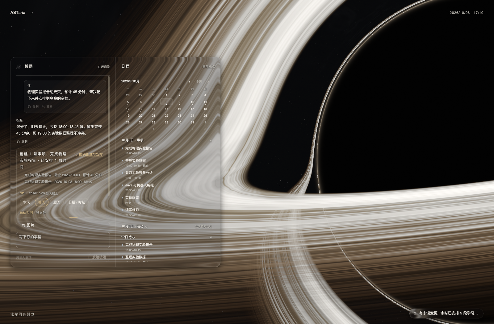
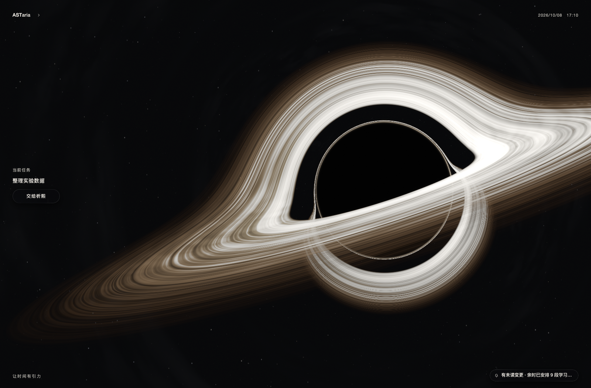
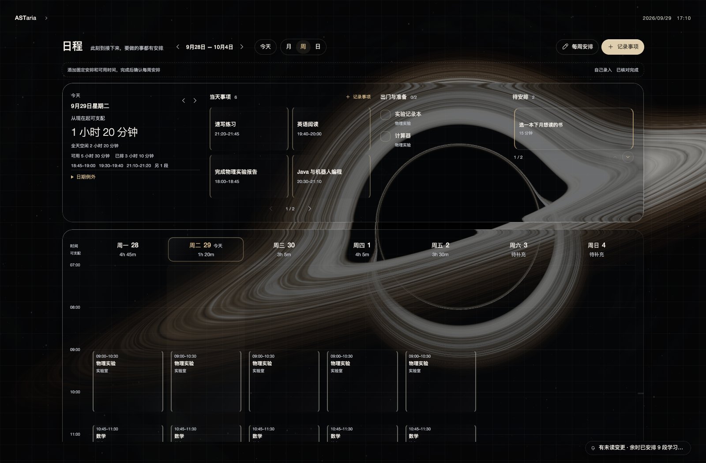
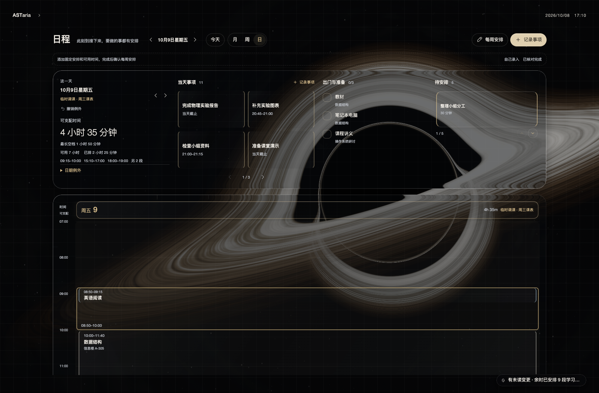
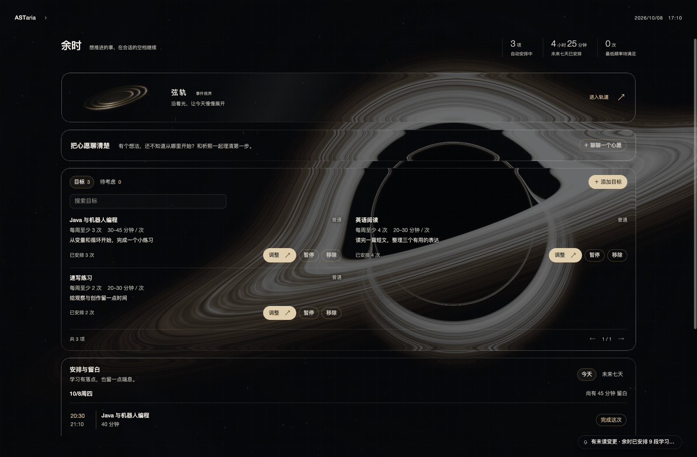
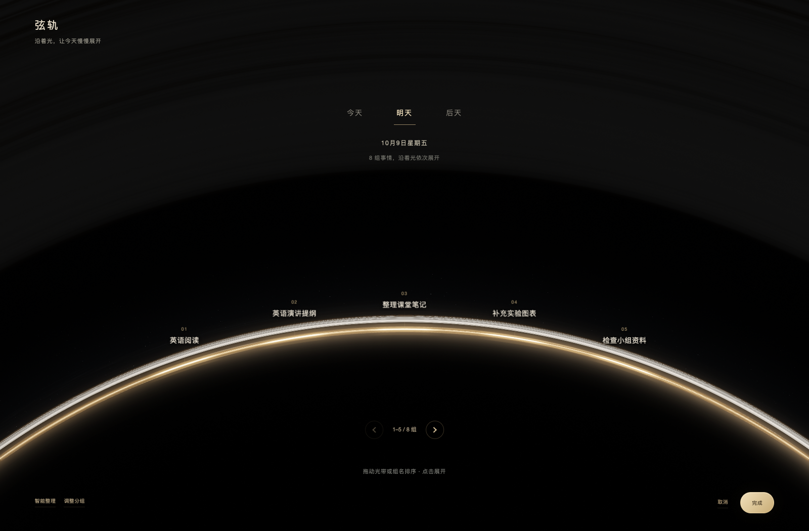
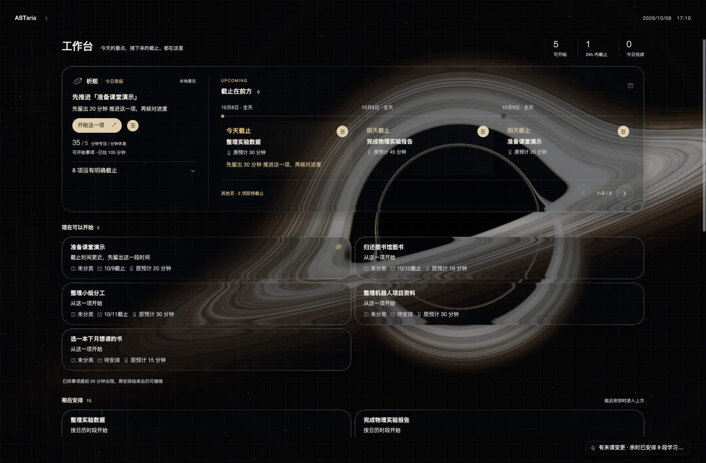
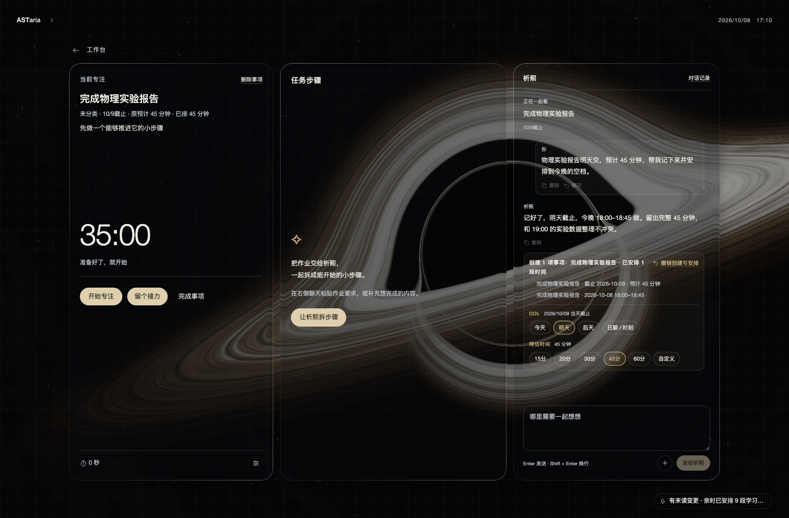

# ASTaria

**让时间有引力**

ASTaria 是一款本机优先的个人时间与事项应用。和析熙聊作业、计划或心愿，把任务放进课程和日常活动之间的真实空档，再从工作台开始专注。

当前版本：**Beta12.1 · 0.1.0-beta.12.1**。本版面向 macOS 13+ Apple Silicon 与 Windows x64，修正首页与工作台专注聊天的图片入口，并让跨页相机转场保持所选帧率，停稳后再启用工作区背景省电上限。Windows 仍为未签名试验版：切页与展开聊天的卡顿尚未完成体验验收，Windows 11、本版实机安装及真实自动升级/回退也未验收。多设备同步继续沿用加密目录协议，实际 Syncthing 传输与后续目录优化仍待完成。

[下载 Beta12.1](https://github.com/Wason-dev/ASTaria/releases/tag/v0.1.0-beta.12.1) · [安装说明](docs/INSTALL.md) · [更新记录](CHANGELOG.md) · [功能详情](docs/FEATURES.md) · [界面与交互规范](docs/UI_DESIGN_SYSTEM.md)

本版的回归检查、当前验收限制、已发布资产的 SHA-256、来源提交、CI、macOS 冒烟与 Windows 包内容核验记录在 [Beta12.1 发布说明](docs/RELEASE_NOTES_v0.1.0-beta.12.1.md)和[验收记录](docs/releases/beta12.1-acceptance.json)。自动化测试不代替真实模型或设备体验验收。

## 看看 ASTaria

以下画面来自真实页面和虚构演示数据，不含个人课表、聊天或密钥。

**一句话，记下事项并安排到真实空档。** 实验报告明天截止，今晚 18:00–18:45 完成；聊天保留析熙的回复，下方回执核对截止、用时和安排，并可一并撤销创建与排程。



**黑洞首页**：收起对话，保留当天事项、日历与析熙入口。



**日程周视图**：同一周展示假期、调休、课程、单日活动和已安排任务。10/5–10/6 放假，10/9 使用周三课表，10/10 周六使用周五课表；校庆活动与待安排事项仍独立保留。



**调课当天**：查看 10/9 的周三课表、课程地点、已排任务和真实剩余空档，不用修改整个每周课表。



**余时**：编程、英语阅读和速写三个持续目标，各自保留频率、单次时长、截止与实际排入日历的记录。



**弦轨**：在真实日期上查看分组、调整顺序和换天，超过一屏的组沿中轴翻页；只改明天时，今天已满不会阻止保存。



**工作台**：从现在可以开始的事项进入专注，同时查看截止、用时与近期任务。



**专注中的析熙**：结合正在进行的事项对话，“发给析熙”左侧的圆形 ＋ 可添加图片，也可以直接拖图。



## Beta12.1 的改动

- **简洁输入框**：首页与工作台「专注」聊天一起移除输入框上方的「图片」入口；圆形 ＋ 位于「发给析熙」左侧。选图后才在输入框下方出现可移除的附件预览。
- **直接拖图**：将图片拖进 ASTaria，当前已打开的专注聊天优先接收；其余正常页面打开首页聊天。拖入只添加附件，仍由你确认发送。设置、弹层或消息忙碌时不接收，普通文字拖动不受影响。
- **附件边界**：每条一张 PNG/JPEG/WebP，不超过 2 MB；选图和拖图共用校验。读取中不能发送，快速换图只保留最后一次选择，失败后不会误带上一张图片。
- **转场帧率修复**：从展开的首页聊天切到工作台等工作区，相机运动期间保持所选 30/45/60/90/120 FPS 预算，默认 60 FPS；相机停稳后背景才降到最高 30 FPS。途中返回同样保留预算，手动画质与特效参数不变。
- **两端补丁与更新**：macOS 与 Windows 共用上述实现，补丁使用 `0.1.0-beta.12.1`，更新器按补丁版本与平台选择配套安装包和签名清单。保留历代优化、省电策略及其验证边界。

网页直取、可撤销回执、图片消息、提醒改期与加密目录同步继续沿用现有能力，详见[功能说明](docs/FEATURES.md)。搜索无正文时的固定兜底、临时调课后自动重排全部余时及同步目录后续优化仍待完成。没有新的实机功耗或性能提升百分比；Windows 卡顿不能据此宣称已解决。

## 安装

macOS 下载 `ASTaria-0.1.0-beta.12.1-mac-arm64-adhoc.dmg`；Windows x64 下载 `ASTaria-0.1.0-beta.12.1-win-x64-setup.exe` 或 `ASTaria-0.1.0-beta.12.1-win-x64-portable.zip`。从 [Beta12.1 Release](https://github.com/Wason-dev/ASTaria/releases/tag/v0.1.0-beta.12.1) 获取校验文件，并按[安装说明](docs/INSTALL.md)核对 SHA-256。

1. macOS：把 DMG 中的 **ASTaria** 拖到 **Applications 快捷方式**，再从应用程序打开。DMG 只提供指向 `/Applications` 的入口。当前包使用 ad-hoc 签名，尚未 Apple 公证。
2. Windows：运行 `setup.exe`，默认安装到当前用户目录，不需要管理员权限；便携 ZIP 须完整解压，再运行其中的 `ASTaria.exe`。Windows EXE 尚未代码签名。
3. 首次启动选择个性、外观、帧率与画质。「ASTaria 推荐」从最高画质开始按持续负载调整；手动画质保持固定。模型连接可稍后设置，然后录入课程、事项和可用时间。

macOS 与 Windows 标准安装版可在「设置 → 通用 → App 更新」检查、下载并验证发布清单的 Ed25519 签名、大小与 SHA-256，再安装并重启。Windows 便携版和非标准安装位置需手动更新；BetaX 的 Windows 版没有应用内更新，首次升级须手动运行新安装包。更新不覆盖本机用户数据，更新前建议导出备份。Windows 真实自动升级和失败回退未实机验收。Intel Mac、iOS、Android 暂无安装包。

在「设置 → 数据 → 跨设备同步」建立或加入同步组，选择共享文件夹或已经配置的 Syncthing 目录。每台设备使用独立 SQLite，目录只传递加密操作；加入需要同步密钥，API Key、聊天与图片不同步。变更回执只证明本机处理结果。更多硬件、多屏、休眠恢复、长期功耗和 Syncthing 实际传输未验收，详见[功能边界](docs/FEATURES.md)。

## 数据与隐私

事项、日程、对话、图片和记忆保存在本机。API Key 在 macOS 使用钥匙串、Windows 桌面使用 DPAPI 保护。云端模型收到本次请求必要的上下文及所附图片；本地模型需自行运行，图像输入取决于模型能力。真实模型下载、推理、工具调用和识图尚未验收。

联网搜索默认关闭。开启后，关键词发送到 DeepSeek 搜索通道；完整网址由本机访问目标网站，不发送到关键词搜索服务。网页抓取拒绝私网与本机地址，目标网站仍能看到请求连接信息。模型上下文不会拼入独立搜索请求。

macOS 数据目录为 `~/Library/Application Support/ASTaria`，Windows 为 `%APPDATA%\ASTaria`。同步不复制聊天、图片、记忆、思考、本地模型路径或运行中的数据库。JSON 备份包含业务数据及图片，不含 API Key 和同步密钥；请妥善保护备份及另存的同步恢复密钥。系统提醒需要通知授权，送达受系统专注模式等限制。详见[安全说明](SECURITY.md)。

## 从源码运行

需要 Node.js **24.19+（24.x）**、npm；macOS 源码运行还需要 Command Line Tools。

```bash
npm ci
npm run dev
```

浏览器打开终端显示的本机地址。Vite 同时启动本机 API，单独托管静态文件不提供任务和模型服务。

```bash
npm test
npm run typecheck
npm run build:desktop
node scripts/verify-doc-versions.mjs
node scripts/run-ui-verifications.mjs --list
node scripts/run-ui-verifications.mjs
```

CI 执行源码测试、桌面网页构建、许可和版本文档检查。隔离 UI 验证使用 Google Chrome（可通过 `CHROME_BINARY` 指定），自动创建并清理测试数据；也可在 Actions 手动运行「UI Verifications」。README 截图通过 `node scripts/capture-readme.mjs` 生成到 `artifacts/readme-capture/`，使用虚构数据和内存数据库，并验证真实保存与撤销，不调用在线模型。测试统计及原生验收边界见版本说明。

## 项目结构

| 目录 | 用途 |
| --- | --- |
| `src/` | React 界面、日程模型与黑洞渲染 |
| `server/` | SQLite、本机 API、析熙与排程 |
| `desktop/` | Electron、提醒与更新安装 |
| `scripts/` | 测试、隔离页面验证、打包工具 |
| `docs/` | 功能、安装与版本说明 |

详细开发与打包说明见[功能与开发文档](docs/FEATURES.md)。问题请提交 [Bug report](https://github.com/Wason-dev/ASTaria/issues/new?template=bug_report.yml)，附版本、系统和复现步骤，避免上传密钥、课表或私密聊天。

## 许可

源码采用 [Apache-2.0](LICENSE)，第三方组件保留各自许可，见 [THIRD_PARTY_NOTICES.txt](THIRD_PARTY_NOTICES.txt)。许可证不授予 ASTaria 名称与标识的商标使用权，见 [NOTICE](NOTICE)。
